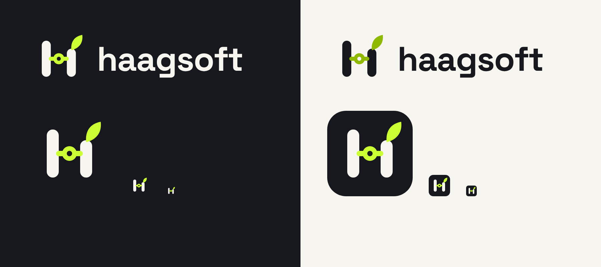

# Haagsoft brand

## The mark

- **H for Haagsoft:** two rounded pillars.
- **The leaf:** *haag* is Dutch for hedge. The right pillar is trimmed short and a lime leaf
  grows out of it, standing for small products that grow, and each app being its own sprout
  on a subdomain.
- **The node:** the crossbar is an edge running through a node, like an agent graph or eval
  harness joining two sides. That's the core specialism: agentic reliability, evals and
  harness engineering.

## Files

| File | Use |
| --- | --- |
| `haagsoft-mark.svg` | App icon, favicon and social avatar (dark tile) |
| `haagsoft-mark-mono.svg` | Inline mark whose pillars use `currentColor`, for `Logo.astro` in both themes |
| `haagsoft-wordmark-on-dark.svg` | Horizontal logo on dark backgrounds |
| `haagsoft-wordmark-on-light.svg` | Horizontal logo on light backgrounds (lime darkened to `#8fb800` for contrast) |

The wordmark is lowercase **haagsoft** in Space Grotesk Bold, converted to outlines so it
doesn't depend on the font being installed.

## Colours

| Token | Hex |
| --- | --- |
| Ink | `#16181d` |
| Paper | `#f7f5f0` |
| Lime (on dark) | `#ccff33` |
| Lime (on light) | `#8fb800` |
